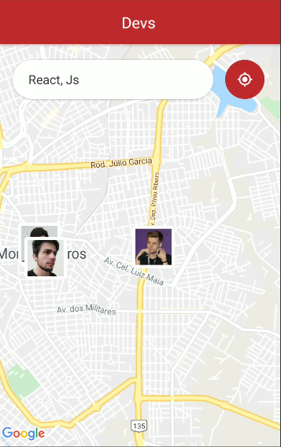

# DevRadar

Uma aplicação que busca desenvolvedores na sua região
### Iniciando a aplicação:

##### Backend

> yarn   # Instala as dependências  yarn dev # Inicializa o servidor
##### Frontend

>   yarn # Instala as dependências  yarn start # Inicializa o React

##### Mobile

> yarn # Instala as dependências   yarn start  # Inicializa o expo

### Frontend WEB

### Frontend Mobile

##### Ferramentas Utilizadas:
* Expo
* Insomnia
* MongoDB
* Yarn
